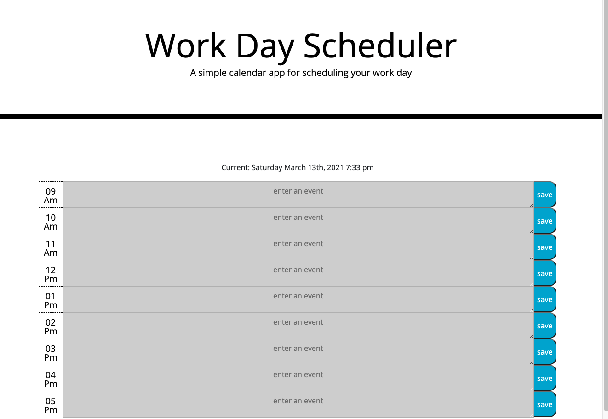

# Day-Planner

For this repository I have created a Daily planner.

-When it loads it welcomes the user and displays the current time.
-Based on the time of day, the slot with the current hour will high light yellow, any slots with hours that have passed will high light in grey, any slots with hours that have yet to come will high light in geen.
-The user is able to click on a text box and enter in any events and save them.
-On reload the events will still be saved.

